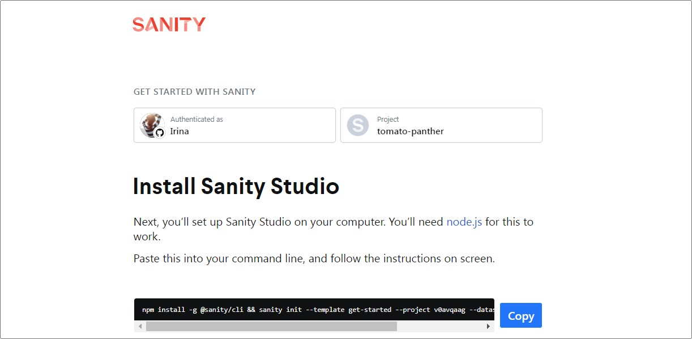
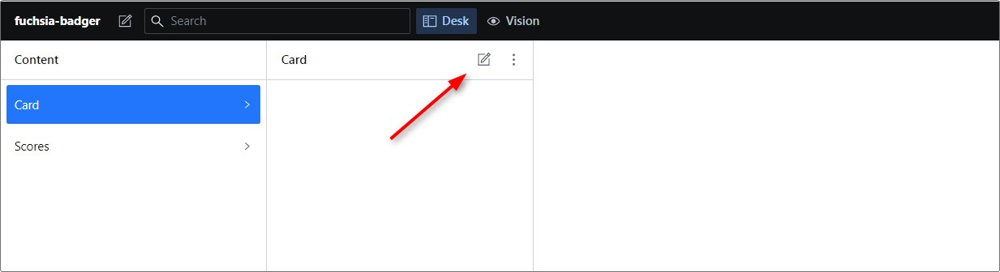
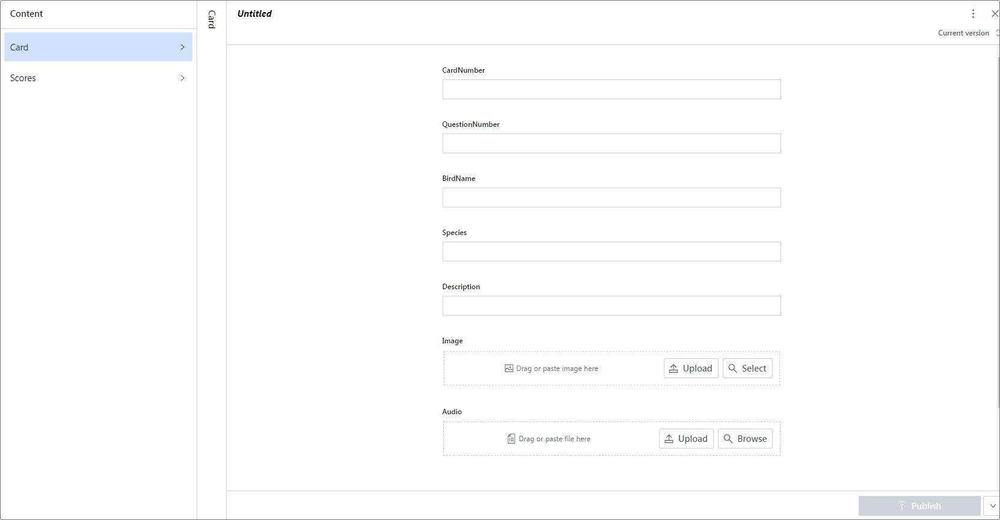
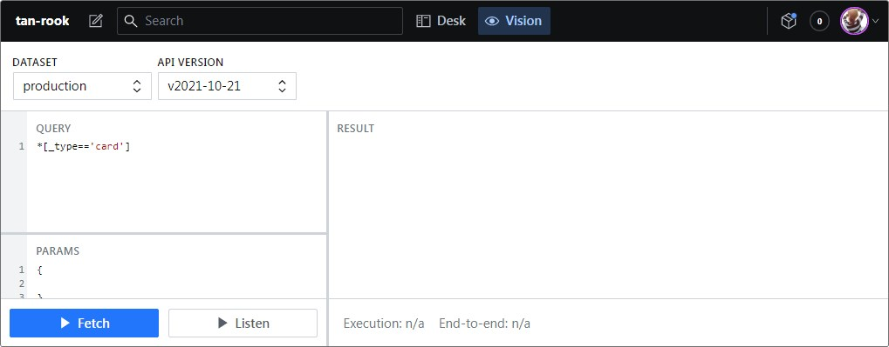
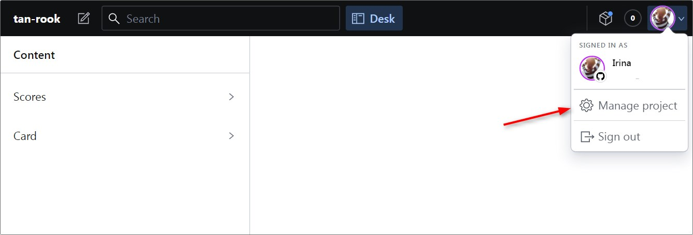
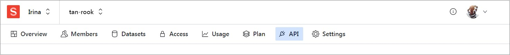
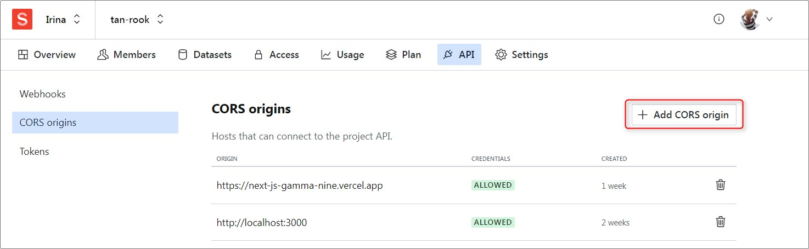
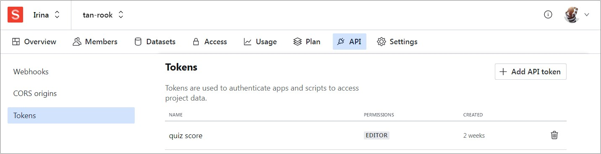

## next-js

deploy: https://next-js-gamma-nine.vercel.app/

## Tutorial

Приложение SongBird - викторина на знание птичьих голосов - мой первый, пока ещё учебный проект в компании [Halo Lab](https://www.halo-lab.com). Работая над ним я познакомилась с новыми для себя технологиями - CMS Sanity и фреймворком Next.js, которые компания использует в своих коммерческих проектах.

- Ссылка на приложение - https://next-js-gamma-nine.vercel.app/
- Репозиторий с проектом - https://github.com/irinainina/next-js
- Репозиторий с Sanity - https://github.com/irinainina/sanity

Такую викторину я уже выполняла раньше, когда учила React, это позволило сравнить особенности создания приложения на чистом React и на связке Sanity+Next.js. Здесь поделюсь тем, что нового узнала, с какими трудностями столкнулась и как их преодолевала.

1. [Sanity. Начало работы](#1-sanity-начало-работы)
2. [Sanity. Добавление schema](#2-sanity-добавление-schema)
3. [Sanity. Получение данных](#3-sanity-получение-данных)
4. [Sanity. Настройки](#4-sanity-настройки)
5. [Sanity. Запись данных](#5-sanity-запись-данных)
6. [Next.js. Начало работы](#6-nextjs-начало-работы)
7. [Next.js. Использование медиафайлов](#7-nextjs-использование-медиафайлов)
8. [Next.js. Компонент Image](#8-nextjs-компонент-image)
9. [Next.js. Передача данных между страницами](#9-nextjs-передача-данных-между-страницами)
10. [Next.js. Библиотеки](#10-nextjs-библиотеки)
11. [Next.js. Аутентификация](#11-nextjs-аутентификация)
12. [Next.js. Системные переменные](#12-nextjs-системные-переменные)

#### 1. Sanity. Начало работы

CMS Sanity используется в качестве источника данных в тех случаях. когда создание самостоятельного бэкенда для приложения нецелесообразно, а хранить данные где-то нужно.

Разумеется, можно получить изображения птиц от API Flickr, а звуки их голосов от API Xeno-canto, но у хранения данных в CMS  много преимуществ:
- есть возможность редактирования данных, например, можно обрезать слишком длинное аудио, или привести все изображения к одному размеру
- мы не зависим от возможных проблем с доступом к сторонним API, и даже если они закроются, приложение останется работоспособным
- все данные приходят из одного источника
- можно не только получать, но и сохранять данные

Работа с Sanity достаточно несложная.

Регистрируемся по ссылке https://www.sanity.io/get-started/create-project

Зарегистрироваться можно через Google, GitHub или по e-mail. Запоминаем способ, который использовали для регистрации.

После регистрации появляется окно создания нового проекта



Копируем предложенный код, выполняем его в терминале.

После завершения установки зависимостей, переходим в папку проекта и запускаем Sanity Studio командой `sanity start`

Переходим по адресу http://localhost:3333. Открывается окно авторизации в Sanity Studio. Авторизуемся тем же способом, который использовали при регистрации на сайте Sanity.

Появляется окно с сообщением, что для работы с Sanity Studio необходимо добавить schema.

#### 2. Sanity. Добавление schema

Schema, которую ожидает от нас Sanity, это просто описание полей, которые должна содержать база данных. Для каждого поля указываем три обязательных параметра:
- `name` - название поля
- `type` - тип данных, которые в нём хранятся
- `title` - заголовок поля в Sanity Studio, чаще всего используем название поля, записанное с заглавной буквы.

Типы данных `number`, `string` и `image` очевидны из их названия, тип данных `file` используется для добавления видео, аудио, pdf-документов и т. д.

Здесь пример того, как выглядит схема карточки птицы для приложения-викторины: https://github.com/irinainina/sanity/blob/main/schemas/card.js

В Sanity Studio можно создать несколько схем. Например, для данного приложения использовались две схемы: первая для хранения данных о птицах, вторая для хранения данных о игроках: их имена и результаты. Все схемы размещаем в папке schemas и импортируем в файл schema.js.

Результат добавления схем в Sanity Studio



Нажимаем на карандаш и добавляем данные о птице. 



Когда все поля будут заполнены, кликаем по кнопке `Publish` справа внизу. Затем опять кликаем на карандаш, и добавляем данные о второй птице и т.д.

#### 3. Sanity. Получение данных

Чтобы получить ссылку на загруженные в Sanity Studio данные, переходим на вкладку Vision. В поле Query уже указан запрос `*[_type=='card']`, который позволяет получить все данные из схемы с именем card



Кликаем на кнопку Fetch и получаем ссылку, по которой открывается API с загруженными данными [https://drzbiexu.api.sanity.io/v2021-10-21/data/query/production?query=*[_type=='card']](https://drzbiexu.api.sanity.io/v2021-10-21/data/query/production?query=*[_type=='card']).

Для удобного просмотра предоставляемых данных в браузере Google Chrome можно установить дополнение [JSON Viewer](https://chrome.google.com/webstore/detail/json-viewer/gbmdgpbipfallnflgajpaliibnhdgobh?hl=ru).

Sanity возвращает не только добавленные нами данные, но также автоматически добавляет для каждой карточки id, даты создания и редактирования. 

Также можно получить только некоторые поля. Для этого на вкладке Vision в поле Query указываем названия полей API, которые хотим получить. Так, например, по запросу `*[_type=='card']{birdNameRU, image}` придут данные только с названиями птиц и их изображениями [https://drzbiexu.api.sanity.io/v2021-10-21/data/query/production?query=*[_type==%27card%27]{birdNameRU,%20image}](https://drzbiexu.api.sanity.io/v2021-10-21/data/query/production?query=*[_type==%27card%27]{birdNameRU,%20image})

Данные с типами `number` и `string` легко получить по названию поля.

Пример кода асинхронной функции для получения названия птицы:

```js
async function getBirdName() {
  const url = `https://drzbiexu.api.sanity.io/v2021-10-21/data/query/production?query=*[_type=='card']`;
  const res = await fetch(url);
  const data = await res.json();
  const birdName = data.result[0].birdNameRU;
  console.log(birdName);
}
```

Путь к данным с типами `image` и `file` включает вложенные объекты `assets` и `_ref` и в результате мы получаем только ключ ссылки на изображение или аудио-файл

Пример кода асинхронной функции для получения ссылки на изображение:

```js
async function getBirdImage() {
  const url = `https://drzbiexu.api.sanity.io/v2021-10-21/data/query/production?query=*[_type=='card']`;
  const res = await fetch(url);
  const data = await res.json();
  const imgKey = data.result[0].image.asset._ref.replace(/image-/, '').replace(/-jpg/, '');
  const imgSrc = `https://cdn.sanity.io/images/drzbiexu/production/${imgKey}.jpg`;
  console.log(imgSrc);
}
getBirdImage();
```

Такие асинхронные функции для получения данных от API используем в Reactе и чистом js.

В фреймворке Next.js функция для получения данных от API выглядит немного иначе:

```js
export const getServerSideProps = async () => {
  const url = `https://drzbiexu.api.sanity.io/v2021-10-21/data/query/production?query=*[_type=='card']`;
  const response = await fetch(url);
  const data = await response.json();
  if (!data) {
    return { notFound: true };
  }
  return {
    props: { birdsData: data.result },
  };
};
```

Более подробная информация о данной функции есть в [документации Next.js](https://nextjs.org/docs/basic-features/data-fetching/get-server-side-props)

#### 4. Sanity. Настройки

Зайти в настройки Sanity можно через веб-интерфейс и через терминал.

Чтобы зайти в настройки через веб-интерфейс, на странице проекта нужно кликнуть по стрелочке возле аватарки и выбрать там пункт "Manage project".



Чтобы зайти в настройки через терминал, нужно зайти в папку проекта и выполнить в терминал команду `sanity manage`

На странице настроек переходим на вкладку API.



В настройках API в разделе CORS origins указываем адреса, с которых будет осуществляться доступ к данным. Эта настройка нужна, если мы, например, храним в Sanity изображения и хотим, чтобы они отображались на страницах нашего приложения. Если такую настройку не выполнить, изображения будут отображаться только в локальной версии проекта, а в задеплоенной версии их не будет из-за ошибки с междоменным запросом.



На скрине выше пример настроек CORS моего проекта. Адрес localhost:3000 внесён для тестирования записи данных. Если цель только получать данные от Sanity, вносить его нет необходимости.



Для записи данных нужно получить токен для чтения и записи данных. Для этого переходим в раздел Tokens и создаём токен на чтение и запись. Созданный токен необходимо скопировать и где-то сохранить для дальнейшего использования, так как после обновления страницы он не будет отображаться из соображений безопасности.

#### 5. Sanity. Запись данных

Sanity позволяет не только читать, но и записывать данные, используя post-запрос.

Для записи данных необходимо создать схему. Пример схемы для сохранения данных о именах игроков и набранных ими баллах: https://github.com/irinainina/sanity/blob/main/schemas/scores.js Это очень простая схема, которая содержит только два поля - имя игрока и его результат как количество набранных баллов.

Код функции для сохранения данных в CMS Sanity частично был взят из [документации Sanity](https://www.sanity.io/docs/http-mutations#73b61a6490eb), частично доработан самостоятельно для отправки междоменных запросов:

```js
import uuid from 'react-uuid';

const saveResult = async (name, score) => {  
  const url =
  'https://drzbiexu.api.sanity.io/v2021-06-07/data/mutate/production';
  const mutations = [
    {
      createOrReplace: {
        _id: uuid(),
        _type: 'scores',
        name: name,
        score: score
      },
    },
  ];

  const response = await fetch(url, {
    method: 'post',
    mode: 'cors',
    cache: 'no-cache',
    credentials: 'same-origin',
    headers: {
      'Content-type': 'application/json',
      Authorization: `Bearer ${process.env.NEXT_PUBLIC_TOKEN}`,
    },
    redirect: 'follow',
    referrerPolicy: 'no-referrer',
    body: JSON.stringify({ mutations }),
  });
  const result = await response.json();
};
export default saveResult;
```

Теперь, когда у нас есть API для чтения и записи данных, переходим к созданию самого приложения на Next.js

#### 6. Next.js. Начало работы

Next.js - основанный на React фреймворк, созданный компанией Vercel. Особенность Next.js - Server-Side Rendering (SSR). При этом данные рендерятся на сервере, а браузер клиента отображает уже готовые веб-страницы. 

Преимущества Next.js для пользователя:
- использует меньше мощностей устройства, так как часть вычислений происходит на сервере
- страницы загружаются и отображаются быстрее
- страницы, код которых видит и понимает поисковый бот, выше ранжируются поисковиками, то есть у пользователя есть больше шансов их увидеть

Преимущества Next.js для разработчика:
- очень легко освоить, если вы уже работали с React
- упрощается создание многостраничных приложений
- упрощается получение данных от API
- отличная документация

Для знакомства с Next.js я использовала [вступительный курс](https://nextjs.org/docs) в документации фреймворка и отличное видео [Next.js. Полный курс](https://youtu.be/GEfR69hL9y0).

Эти два источника позволят комфортно и уверенно приступить к работе над приложением на Next.js.
Дальше остановлюсь на тех моментах, которые оказались для меня менее очевидными.

#### 7. Next.js. Использование медиафайлов

Для большинства медиафайлов: изображений, аудио- и видеофайлов в настройках Next.js нужно добавить разрешение на их использование.

##### Изображения

Next.js. отлично работает с картинками из папки public. Их не нужно импортировать в jsx, к ним даже не нужно прописывать полный адрес. Но использование изображений с внешних ресурсов необходимо разрешить дополнительно, указав в файле конфигурации домен, с которого их получаем. Так, например, для изображений, которые приходят от Sanity в файл next.config.js добавляем следующий код

```js
module.exports = {
  images: {
    domains: ['cdn.sanity.io']
  }
};
```

Ещё один важный момент: чтобы изменения в файле next.config.js вступили в силу, после его редактирования необходимо перезагрузить сервер (`Ctrl+C` - остановить сервер, `npm run dev` - запустить его снова).

##### Аудио

Для добавления возможности использовать в Next.js аудиофайлы устанавливаем пакет `file-loader` командой

```npm install file-loader```

Затем редактируем файл next.config.js: 

```js
module.exports = {
  webpack(config, options) {
    config.module.rules.push({
      test: /\.(ogg|mp3|wav|mpe?g)$/i,
      use: [
        {
          loader: 'url-loader',
          options: {
            name: '[name]-[hash].[ext]',
          },
        },
      ],
    });
    return config;
  }
});
```

В отличие от изображений, видео и аудио необходимо импортировать, даже если они находятся в папке public.

##### Видео

Чтобы разрешить использовать видео, устанавливаем пакет `next-videos` командой

```npm install next-videos```

Затем редактируем файл next.config.js 

```js
const withVideos = require('next-videos');
module.exports = withVideos();
```

Все перечисленные разрешения на использования полученных от Sanity изображений, а также аудио и видео в файле конфигурации [next.config.js](https://github.com/irinainina/next-js/blob/main/next.config.js) 

#### 8. Next.js. Компонент Image

Для добавления изображений в jsx в Next.js используется компонент Image.

Если добавить изображение так, как это указано в [документации](https://nextjs.org/docs/api-reference/next/image#loader), будут проблемы с размером. Несмотря на то, что  коде явно указывается ширина и высота изображения, Next.js меняет их согласно своим собственным алгоритмам. Чтобы жестко зафиксировать нужный размер, в код компонента Image добавляем свойство layout="fixed".

Такой подход работает, если размер изображения не должен изменяться ни на одном разрешении экрана, но не подходит для добивления адаптивных изображений.

Если цель добавить адаптивное изображение, размер которого регулируется медиазапросами, необходимо вложить изображению в блок-обёртку, при этом самому компоненту Image указываем свойство layout="fill". Размеры компонента Image в jsx в этом случае не указываем.

```js
<div className={styles.imageContainer}>
  <Image
    src={path}
    className={styles.image}
    alt="image"
    layout="fill"
  />
</div>
```

В стилях для изображения и контейнера указываем следующие свойства

```css
.imageContainer {
  width: 500px;
  height: 280px;
  overflow: hidden;
}

.imageContainer * {
  position: unset !important;
}

.image {
  object-fit: cover;
  object-position: center center;
  width: 100% !important;
  position: relative !important;
  height: 100% !important;
}
```

#### 9. Next.js. Передача данных между страницами

В Next.js. существует как минимум три способа для передачи данных между страницами:
- при помощи query-параметров
- использование хука useContext и создание провайдера
- использование хука [useLocalStorage](https://usehooks.com/useLocalStorage/)

Самый простой способ - использовать для передачи данных [query-параметры](https://branch.io/glossary/query-parameters/).

Для этого в компонент Link, который ведёт на другую страницу, после адреса через знак вопроса добавляем нужное значение, которое необходимо на эту страницу передать.

Чтобы получить переданное при помощи query-параметра значение, импортируем `useRouter` и получаем значение переданного в него query-параметра:

```js
import { useRouter } from 'next/router';

const { asPath } = useRouter();
const query = asPath.split('?')[1];
```

Передача данных при помощи query-параметров подойдёт, если нужно передать одно конкретное значение конкретной странице.

Если необходимо передавать состояние, или передавать значение не одной, а нескольким страницам, используем хук useContext.

Особенности его использования можно рассмотреть на примере функции для перевода страниц приложения, каждая из которых должна получить значение выбранного пользователем языка.

Код передачи данных при помощи хука useContext включает в себя:
- [создание провайдера](https://github.com/irinainina/next-js/blob/main/translation/LangContext.js)
- [подключение провайдера](https://github.com/irinainina/next-js/blob/main/pages/_app.js)
- [смена передаваемого значения](https://github.com/irinainina/next-js/blob/main/components/LangSelector/LangSelector.js)
- [использование передаваемого значения](https://github.com/irinainina/next-js/blob/main/scenes/HomePage/HomePage.js)

#### 10. Next.js. Библиотеки

Если библиотека не поддерживает Server-Side Rendering, можно попробовать установить её без SSR:

```js
import dynamic from "next/dynamic";
const OwlCarousel = dynamic(() => import("react-owl-carousel"), {
  ssr: false,
});
```

Но лучше выбирать библиотеки, специально написанные для Nex.js, в которых есть поддержка SSR.

Особенно сложно было найти бесконечный слайдер для Next.js. В итоге была найдена библиотека `react-stacked-carousel` с интересной анимацией и плавным перелистыванием слайдов.

#### 11. Next.js. Аутентификация

Для аутентификации в проекте используется библиотека `next-auth`, созданная специально для Next.js.

У библиотеки большая, развёрнутая [документация](https://next-auth.js.org/configuration/options).

Чтобы подключить библиотеку, кроме установки зависимостей, нужно внести изменения в четыре файла на вашем проекте:
1. Добавляем API router

Для этого в папке api создаём папку auth, и по адресу `pages/api/auth` создаём файл `[...nextauth].js`. Содержание файла копируем из [документации](https://next-auth.js.org/getting-started/example#add-api-route)

Способов аутентификации пользователей можно использовать несколько, начать лучше с Github, для него получение GITHUB_ID и GITHUB_SECRET вызывает меньше всего проблем. 

2. В файл `_app.js` импортируем `SessionProvider` из библиотеки `next-auth` и оборачиваем в него содержимое файла:

```js
import { SessionProvider } from 'next-auth/react';

function MyApp({ Component, pageProps }) {
  return (
    <SessionProvider session={pageProps.session}>      
      <Component {...pageProps} />
    </SessionProvider>
  );
}

export default MyApp;
```

3. Из [репозитория проекта](https://github.com/nextauthjs/next-auth-example/blob/main/components/header.tsx) копируем `div` с классом `signedInStatus` и относящиеся к нему зависимости и добавляем их в своё приложение. Они будут осуществлять аутентификацию/разаутентификацию пользователя.

4. И последний штрих - получение _ID и _SECRET различных провайдеров, предоставляющих свои API для аутентификации пользователей. Инструкции как их получить есть на youtube, выбирать желательно максимально свежие, так как интерфейсы сатов меняются очень быстро.

Пример [плейлиста](https://www.youtube.com/playlist?list=PLC5vixW_4xSKaJbHyvyHiY8_H4T__L5le) в котором автор демонстрирует использование для аутентификации GitHub, Google, Twitter, Facebook провайдеров.

#### 12. Next.js. Переменные окружения

Об .env файле проекта хорошо объясняется в [видео](https://youtu.be/GEfR69hL9y0?t=3539), которое использовала для изучения Next.js. В этом же [видео](https://youtu.be/GEfR69hL9y0?t=4393) рассказывается как добавить переменные окружения на сайт Vercel, куда удобно деплоить Next.js приложения.

Остановлюсь на особенностях переменных окружения в Next.js
1. .env файл в Next.js называется .env.local
2. название переменной должно начинаться с NEXT_PUBLIC_
3.  если менялись переменные окружения, при деплое приложения на vercel необходимо выполнить редеплой, чтобы переменные обновились - [видео](https://youtu.be/GEfR69hL9y0?t=4507)
